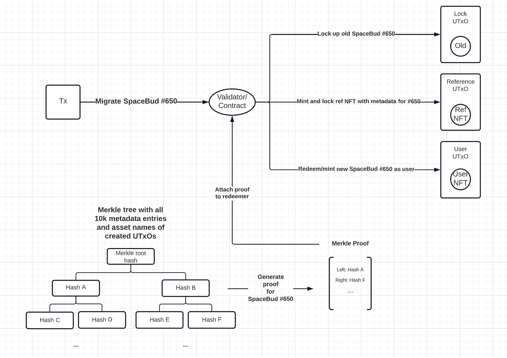

<p align="center">
  
</p>

# Wormhole

The SpaceBudz wormhole contract. Moving from CIP-0025 to CIP-0068.

## Official SpaceBudz Policy

Policy Id: **4523c5e21d409b81c95b45b0aea275b8ea1406e6cafea5583b9f8a5f**

## Requirements

- Deno >= 1.28.1

## Installation

### Deno
```js
import { Contract } from "https://deno.land/x/wormhole@1.0.2/mod.ts";
```

### NPM
```
npm install @spacebudz/wormhole
```

## Get started

```ts
import { Lucid, Blockfrost } from "https://deno.land/x/lucid@0.10.0/mod.ts";
import { Contract } from "https://deno.land/x/wormhole@1.0.2/mod.ts";

const lucid = await Lucid.new(new Blockfrost(...));

lucid.selectWalletFromSeed(
  "<seed_phrase>",
);

const contract = new Contract(lucid);

// Logging the SpaceBudz policy id
console.log(contract.mintPolicyId);

// Migrate SpaceBud #10
console.log(await contract.migrate([10]));
```

## Compile contract
```
deno task build:contract
```
See [requirements](./src/ghc/README.md).

## Bundle for NPM
```
deno task build
```
Outputs a `dist` folder.
Lucid needs to be imported separately and is a peer dependency (version `@0.10.0`).

## Contract endpoints

```ts
migrate(ids: number[]): Promise<TxHash>
```
```ts
deployScripts(): Promise<TxHash>
```
```ts
burn(id: number): Promise<TxHash> 
```
```ts
move(id: number): Promise<TxHash> 
```
```ts
updateIp(url: string): Promise<Transaction> 
```
```ts
updateRoyalty(royaltyRecipients: RoyaltyRecipient[]): Promise<Transaction> 
```
```ts
getRoyalty(): Promise<RoyaltyRecipient[]>
```
```ts
getMetadata(id: number): Promise<Json>
```
```ts
hasMigrated(id: number): Promise<boolean>
```
```ts
getDeployedScripts(): Promise<{ mint: UTxO }> 
```

## How the wormhole works

In order to migrate a SpaceBud of the old collection, three outputs need to be created:

- Lock address holding the old SpaceBud
- Reference address holding the `reference NFT` with the metadata in the datum
- Wallet address receives the `user NFT` that represent the new SpaceBud

The `reference NFT` and `user NFT` are minted during the transaction and need to follow the CIP-0068 (222) sub standard.
To validate metadata and correctness of the minted SpaceBud a merkle tree is used that contains 10,000 entries. Each entry is a `sha2_256` hash of:
```
metadata hash + asset name of reference NFT + asset name of user NFT + asset name of single asset sent to Lock address
```
Only a small merkle tree proof needs to be brought on-chain to make sure a SpaceBud is minted correctly




## Exceptions for Twin SpaceBudz

To keep integrity for the twins `1903` and `6413` (with quantity 2) some extra steps are required.
Important is that there exists only ever one reference NFT. In order to achieve this the reference NFTs including their respective metadata are preminted and locked in the script UTxO.
Whenever you migrate a twin you mint a mock reference NFT (with label 1), that doesn't really have any functionality, but it allows to keep the existing contract logic as it is. 
No unnecessary complexity and risk needs to be introduced into the contract.